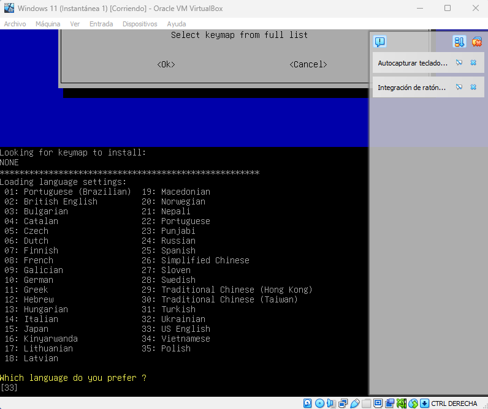
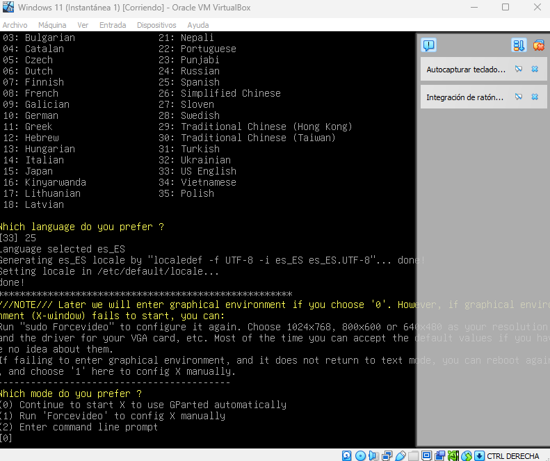

### Asignando memoria a la partición del disco de Windows 11
####

#### Paso 1:

####
#### Paso 2:

####
#### Paso 3:

####
#### Paso 4:

####
#### Paso 5:

####
#### Paso 6:

####
#### Paso 7:

####
#### Paso 8:

####
#### Paso 9:

####
#### Paso 10:

*Volver* [:leftwards_arrow_with_hook:](..)
